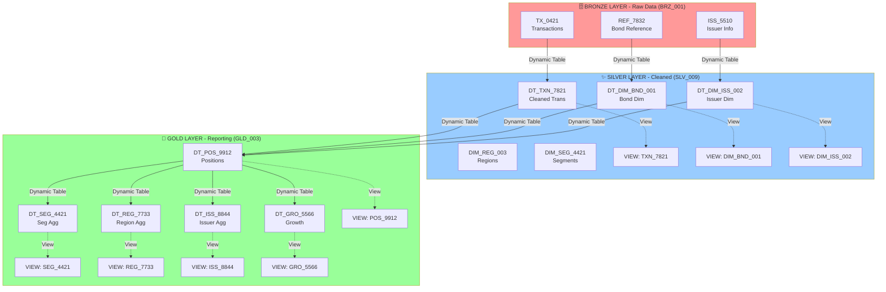
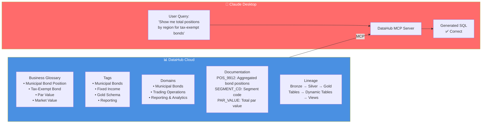
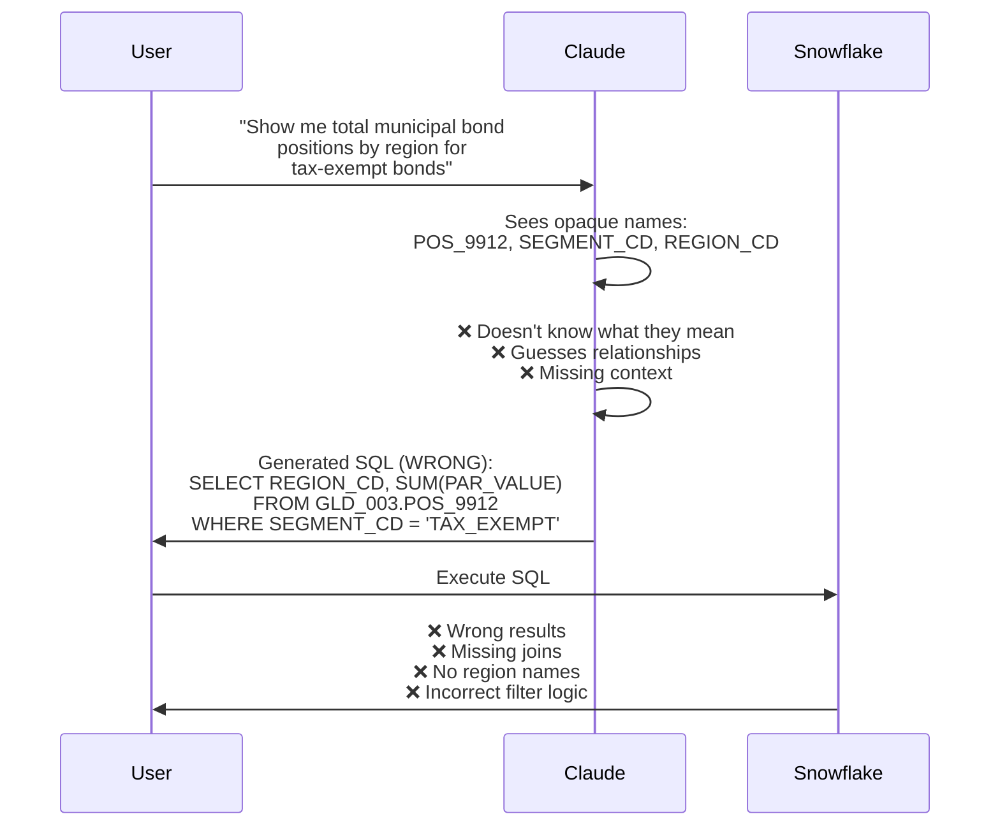
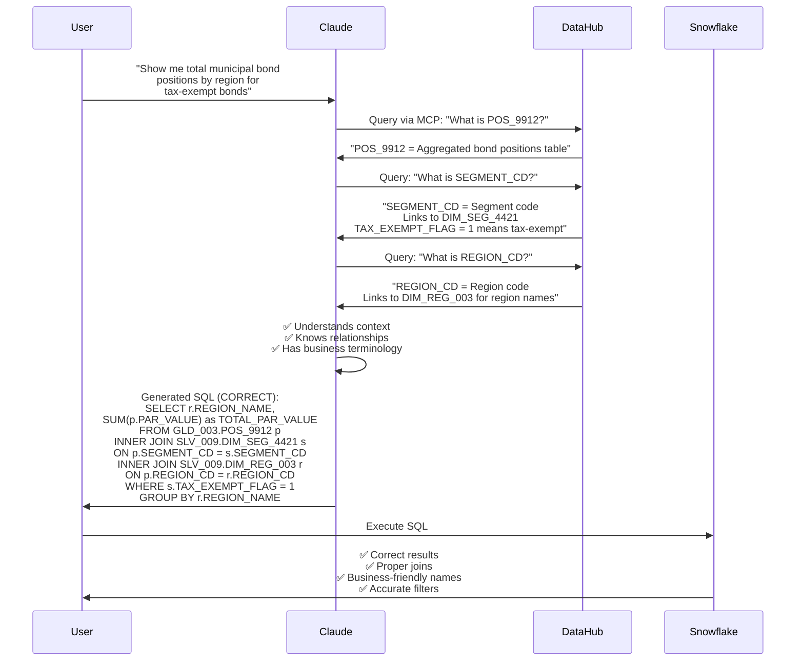
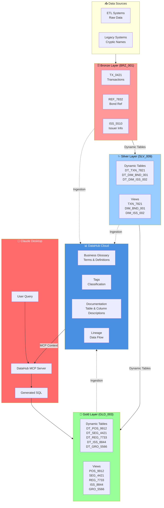

# PIMCO DataHub LLM Demo - Architecture & Story

## Overview

This demo showcases how **DataHub transforms LLM text-to-SQL generation** by providing context about opaque schema and table names. The architecture demonstrates a real-world data pipeline with Bronze → Silver → Gold transformations, enhanced by DataHub metadata for better AI context.

---

## The Story: Without vs. With DataHub

### The Problem: Opaque Names in Production

In real-world production systems, data engineers often use cryptic naming conventions:
- `POS_9912` - What does this mean?
- `SEG_4421` - What is this?
- `REG_7733` - How do I use this?

**Without DataHub**, LLMs see these opaque names and must guess what they mean, leading to incorrect SQL generation.

### The Solution: DataHub Provides Context

**With DataHub**, LLMs can retrieve context about:
- What each table contains
- What each column means
- How tables relate to each other
- Business terminology for cryptic names

This enables **correct SQL generation** with proper joins, filters, and aggregations.

---

## Data Architecture: Bronze → Silver → Gold

### Data Flow Diagram



### Layer Details

#### 🗄️ Bronze Layer (BRZ_001) - Raw Data
- **TX_0421**: Raw bond transactions
- **REF_7832**: Bond reference data
- **ISS_5510**: Issuer information
- **Opaque naming** by design (simulates production systems)

#### ✨ Silver Layer (SLV_009) - Cleaned Data
- **Dynamic Tables**: Automatically transform bronze data
  - `DT_TXN_7821`: Cleaned transactions
  - `DT_DIM_BND_001`: Bond dimension
  - `DT_DIM_ISS_002`: Issuer dimension
- **Static Tables**: Reference dimensions
  - `DIM_REG_003`: Region lookup
  - `DIM_SEG_4421`: Segment lookup
- **Views**: Clean querying interface

#### 💎 Gold Layer (GLD_003) - Reporting Data
- **Dynamic Tables**: Auto-aggregated reporting data
  - `DT_POS_9912`: Aggregated positions
  - `DT_SEG_4421`: Segment aggregations
  - `DT_REG_7733`: Region aggregations
  - `DT_ISS_8844`: Issuer aggregations
  - `DT_GRO_5566`: Growth metrics
- **Views**: Business-friendly querying interface

---

## The Challenge: Opaque Names

### What LLMs See Without DataHub

```
PIMCO_DEMO Database
│
├── BRZ_001 (Bronze)
│   ├── TX_0421      ← What is this?
│   ├── REF_7832     ← What is this?
│   └── ISS_5510     ← What is this?
│
├── SLV_009 (Silver)
│   ├── DT_TXN_7821  ← What is this?
│   ├── DIM_BND_001  ← What is this?
│   └── DIM_ISS_002  ← What is this?
│
└── GLD_003 (Gold)
    ├── POS_9912     ← What is this?
    ├── SEG_4421     ← What is this?
    ├── REG_7733     ← What is this?
    ├── ISS_8844     ← What is this?
    └── GRO_5566     ← What is this?
```

### What LLMs Don't Know
- ❌ What `POS_9912` means
- ❌ What `SEGMENT_CD` contains
- ❌ How to join tables together
- ❌ What `TAX_EXEMPT_FLAG = 1` means
- ❌ Which tables have the data they need

**Result**: ❌ Guessing, wrong SQL, missing joins, incorrect filters

---

## The Solution: DataHub Context

### DataHub Metadata Layer



### What DataHub Provides

#### 📚 Business Glossary
Maps opaque names to business terms:
- `POS_9912` → **"Municipal Bond Position"**
- `SEGMENT_CD` → **"Bond Segment"**
- `PAR_VALUE` → **"Par Value"**
- `TAX_EXEMPT_FLAG` → **"Tax-Exempt Municipal Bond"**

#### 🏷️ Tags
Classification for discovery:
- `Municipal Bonds`, `Fixed Income`, `Gold Schema`, `Reporting`

#### 📁 Domains
Business area organization:
- `Municipal Bonds`, `Trading Operations`, `Reporting & Analytics`

#### 📝 Documentation
Table and column descriptions:
- `POS_9912`: "Aggregated bond positions table. Contains total positions by bond, issuer, region, and segment with par value and market value. This is the primary table for position reporting."
- `SEGMENT_CD`: "Segment code - TAX_EXEMPT or TAXABLE"
- `REGION_CD`: "Region code - links to DIM_REG_003 for region names"

#### 🔗 Lineage
Shows data flow:
- `BRZ_001.TX_0421` → `SLV_009.DT_TXN_7821` → `GLD_003.DT_POS_9912`
- `GLD_003.POS_9912` (view) → `GLD_003.DT_POS_9912` (dynamic table)

---

## Demo Flow: Before vs. After

### ❌ Without DataHub Context



**Issues:**
- Missing joins with dimension tables
- No region names (only codes)
- Wrong filter logic
- No understanding of data relationships

### ✅ With DataHub Context



**Success:**
- ✅ Correct joins with dimension tables
- ✅ Business-friendly column names
- ✅ Proper filter logic
- ✅ Understanding of data relationships

---

## Complete Architecture Diagram



---

## Example Queries: Before vs. After

### Example 1: Total Positions by Region for Tax-Exempt Bonds

#### ❌ Without DataHub Context

**Query:**
> "Show me total municipal bond positions by region for tax-exempt bonds"

**Generated SQL:**
```sql
SELECT 
    REGION_CD,
    SUM(PAR_VALUE) as total_par
FROM GLD_003.POS_9912
WHERE SEGMENT_CD = 'TAX_EXEMPT'
GROUP BY REGION_CD;
```

**Problems:**
- ❌ Returns region codes instead of names
- ❌ Missing join with `DIM_REG_003`
- ❌ Missing join with `DIM_SEG_4421`
- ❌ Wrong filter logic (should use `TAX_EXEMPT_FLAG = 1`)

#### ✅ With DataHub Context

**Query:**
> "Show me total municipal bond positions by region for tax-exempt bonds. Use DataHub to understand the schema."

**Generated SQL:**
```sql
SELECT 
    r.REGION_NAME,
    SUM(p.PAR_VALUE) as TOTAL_PAR_VALUE,
    SUM(p.MARKET_VALUE) as TOTAL_MARKET_VALUE,
    COUNT(DISTINCT p.BOND_ID) as POSITION_COUNT
FROM GLD_003.POS_9912 p
INNER JOIN SLV_009.DIM_SEG_4421 s ON p.SEGMENT_CD = s.SEGMENT_CD
INNER JOIN SLV_009.DIM_REG_003 r ON p.REGION_CD = r.REGION_CD
WHERE s.TAX_EXEMPT_FLAG = 1
  AND p.AS_OF_DATE = CURRENT_DATE()
GROUP BY r.REGION_NAME
ORDER BY TOTAL_PAR_VALUE DESC;
```

**Success:**
- ✅ Returns region names (business-friendly)
- ✅ Proper joins with dimension tables
- ✅ Correct filter logic (`TAX_EXEMPT_FLAG = 1`)
- ✅ Includes all relevant metrics

---

### Example 2: Position Growth Over Time

#### ❌ Without DataHub Context

**Generated SQL:**
```sql
SELECT 
    METRIC_DATE,
    SEGMENT_CD,
    TOTAL_PAR_VALUE
FROM GLD_003.GRO_5566
WHERE METRIC_DATE >= DATEADD(day, -30, CURRENT_DATE());
```

**Problems:**
- ❌ Returns segment codes instead of names
- ❌ Missing join with `DIM_SEG_4421`

#### ✅ With DataHub Context

**Generated SQL:**
```sql
SELECT 
    g.METRIC_DATE,
    s.SEGMENT_NAME,
    g.TOTAL_PAR_VALUE,
    g.TOTAL_MARKET_VALUE,
    g.VALUE_CHANGE,
    g.PCT_CHANGE
FROM GLD_003.GRO_5566 g
INNER JOIN SLV_009.DIM_SEG_4421 s ON g.SEGMENT_CD = s.SEGMENT_CD
WHERE g.METRIC_DATE >= DATEADD(day, -30, CURRENT_DATE())
ORDER BY g.METRIC_DATE DESC, s.SEGMENT_NAME;
```

**Success:**
- ✅ Returns segment names (business-friendly)
- ✅ Proper join with dimension table
- ✅ Includes all growth metrics

---

## Key Components Summary

### Data Layers

| Layer | Purpose | Tables | Dynamic Tables | Views |
|-------|---------|--------|----------------|-------|
| **Bronze** | Raw data | 3 tables | - | - |
| **Silver** | Cleaned data | 2 static | 5 dynamic | 3 views |
| **Gold** | Reporting data | - | 5 dynamic | 5 views |

### DataHub Metadata

| Component | Purpose | Examples |
|-----------|---------|----------|
| **Business Glossary** | Maps opaque names to business terms | `POS_9912` → "Municipal Bond Position" |
| **Tags** | Classification for discovery | Municipal Bonds, Gold Schema, Reporting |
| **Domains** | Business area organization | Municipal Bonds, Trading Operations |
| **Documentation** | Table/column descriptions | Explains what cryptic names mean |
| **Lineage** | Data flow visualization | Bronze → Silver → Gold |

### LLM Integration

| Component | Purpose |
|-----------|---------|
| **DataHub MCP Server** | Provides context to Claude Desktop |
| **Claude Desktop** | Generates SQL using DataHub context |
| **Snowflake** | Executes SQL queries |

---

## The Value Proposition

### Without DataHub

```
User Query
    ↓
LLM (No Context)
    ↓
❌ Wrong SQL
    ↓
❌ Wrong Results
    ↓
❌ User Frustration
```

### With DataHub

```
User Query
    ↓
LLM (With DataHub Context)
    ↓
✅ Correct SQL
    ↓
✅ Accurate Results
    ↓
✅ Business Value
```

### Key Benefits

1. **Faster Time to Insights**: No more guessing what tables mean
2. **Accurate SQL Generation**: Proper joins, filters, aggregations
3. **Business-Friendly Results**: Column names users understand
4. **Reduced Errors**: Fewer incorrect queries
5. **Better Decision-Making**: Reliable data for business decisions

---

## Real-World Application

### Production Scenario

```
┌─────────────────────────────────────────────────────────────┐
│  PRODUCTION DATA WAREHOUSE                                   │
├─────────────────────────────────────────────────────────────┤
│                                                              │
│  • ETL systems create tables with cryptic names              │
│  • Legacy systems use abbreviations (POS_9912, SEG_4421)    │
│  • Data warehouses use opaque naming conventions             │
│  • New team members don't understand the schema              │
│                                                              │
│  ❌ Without DataHub:                                         │
│     • LLMs guess what tables mean                           │
│     • Developers write incorrect SQL                         │
│     • Analysts struggle to find the right data              │
│     • Time wasted on debugging wrong queries                │
│                                                              │
│  ✅ With DataHub:                                            │
│     • LLMs understand schema via context                     │
│     • Developers generate correct SQL                        │
│     • Analysts find data quickly                             │
│     • Time saved, insights faster                            │
│                                                              │
└─────────────────────────────────────────────────────────────┘
```

---

## Demo Script

### Part 1: Set the Stage (2 minutes)

1. **Show the Problem**
   - Explain opaque naming in production systems
   - Show cryptic table names (`POS_9912`, `SEG_4421`, etc.)
   - Explain why this is a common challenge

2. **Show the Architecture**
   - Bronze → Silver → Gold flow
   - Dynamic tables doing transformations
   - Views providing clean querying

### Part 2: Without DataHub (3 minutes)

1. **Show User Query**
   - "Show me total municipal bond positions by region for tax-exempt bonds"

2. **Show Claude's Response (Without Context)**
   - Sees opaque names
   - Generates incorrect SQL
   - Missing joins, wrong filters

3. **Show Results**
   - Execute SQL in Snowflake
   - Show wrong/missing results
   - Explain the problems

### Part 3: With DataHub (5 minutes)

1. **Show DataHub Metadata**
   - Business glossary mapping opaque names
   - Documentation explaining tables
   - Tags and domains organizing data

2. **Show Claude's Response (With Context)**
   - Queries DataHub via MCP
   - Understands what tables mean
   - Generates correct SQL

3. **Show Results**
   - Execute SQL in Snowflake
   - Show correct results
   - Highlight the difference

### Part 4: The Value (2 minutes)

1. **Compare Before/After**
   - Side-by-side SQL comparison
   - Results comparison
   - Time saved

2. **Real-World Impact**
   - Faster time to insights
   - Accurate SQL generation
   - Better decision-making

---

## Visual Architecture Summary

```
┌─────────────────────────────────────────────────────────────────┐
│                    COMPLETE DATA PIPELINE                         │
└─────────────────────────────────────────────────────────────────┘

┌──────────────┐     ┌──────────────┐     ┌──────────────┐
│   BRONZE     │────▶│   SILVER     │────▶│    GOLD      │
│  (Raw Data)  │     │ (Cleaned)    │     │ (Reporting)  │
│              │     │              │     │              │
│  TX_0421     │     │  DT_TXN_7821 │     │  DT_POS_9912 │
│  REF_7832    │     │  DT_DIM_BND  │     │  DT_SEG_4421 │
│  ISS_5510    │     │  DT_DIM_ISS  │     │  DT_REG_7733 │
│              │     │              │     │  DT_ISS_8844 │
│              │     │              │     │  DT_GRO_5566  │
│              │     │              │     │              │
│              │     │  Views:      │     │  Views:      │
│              │     │  TXN_7821     │     │  POS_9912    │
│              │     │  DIM_BND_001 │     │  SEG_4421    │
│              │     │  DIM_ISS_002 │     │  REG_7733    │
│              │     │              │     │  ISS_8844    │
│              │     │              │     │  GRO_5566    │
└──────────────┘     └──────────────┘     └──────────────┘
       │                    │                    │
       │                    │                    │
       └────────────────────┼────────────────────┘
                            │
                            ▼
                    ┌──────────────┐
                    │   DATAHUB     │
                    │   (Metadata)  │
                    │               │
                    │  • Glossary    │
                    │  • Tags        │
                    │  • Domains     │
                    │  • Docs        │
                    │  • Lineage     │
                    └──────────────┘
                            │
                            │ MCP Server
                            ▼
                    ┌──────────────┐
                    │    CLAUDE     │
                    │  (LLM)        │
                    │               │
                    │  Generates    │
                    │  SQL with     │
                    │  Context      │
                    └──────────────┘
                            │
                            │ SQL Query
                            ▼
                    ┌──────────────┐
                    │   SNOWFLAKE   │
                    │  (Results)    │
                    │               │
                    │  ✅ Correct    │
                    │  ✅ Accurate   │
                    │  ✅ Fast       │
                    └──────────────┘
```

---

## Key Takeaways

### 🎯 The Problem
- Production systems use opaque naming conventions
- LLMs can't understand cryptic table/column names
- Without context, LLMs guess and generate incorrect SQL

### 💡 The Solution
- DataHub provides business glossary, documentation, tags, domains
- DataHub MCP server gives LLMs context about schema
- With context, LLMs generate correct SQL with proper joins and filters

### 📈 The Value
- **Faster Time to Insights**: No more guessing what tables mean
- **Accurate SQL Generation**: Proper joins, filters, aggregations
- **Business-Friendly Results**: Column names users understand
- **Reduced Errors**: Fewer incorrect queries
- **Better Decision-Making**: Reliable data for business decisions

---

## Architecture Highlights

### ✅ Clean Architecture
- **Bronze → Silver → Gold**: Clear data flow
- **Dynamic Tables**: Automatic transformations
- **Views**: Clean querying interface
- **No Redundancy**: No empty tables

### ✅ DataHub Integration
- **Business Glossary**: Maps opaque names to business terms
- **Documentation**: Explains what cryptic names mean
- **Tags & Domains**: Organizes data for discovery
- **Lineage**: Shows data flow clearly

### ✅ LLM Enhancement
- **MCP Server**: Provides context to Claude
- **Context-Aware SQL**: Generates correct queries
- **Business-Friendly**: Uses proper terminology

---

This architecture demonstrates how **DataHub transforms LLM text-to-SQL generation** by providing crucial context about opaque data structures, making AI-powered data querying practical for real-world production scenarios.

---

## Demo Checklist

- [ ] Show Bronze → Silver → Gold architecture
- [ ] Demonstrate opaque naming challenge
- [ ] Show DataHub metadata (glossary, tags, docs)
- [ ] Demo without DataHub (wrong SQL)
- [ ] Demo with DataHub (correct SQL)
- [ ] Compare before/after results
- [ ] Explain real-world value
- [ ] Answer questions

**Total Demo Time: ~12-15 minutes**
